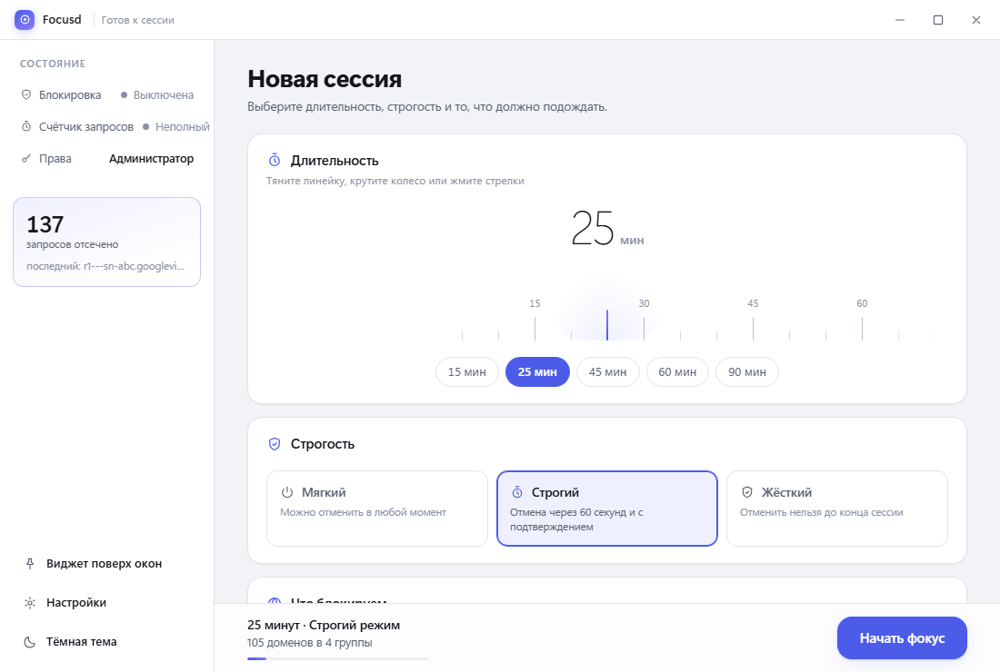
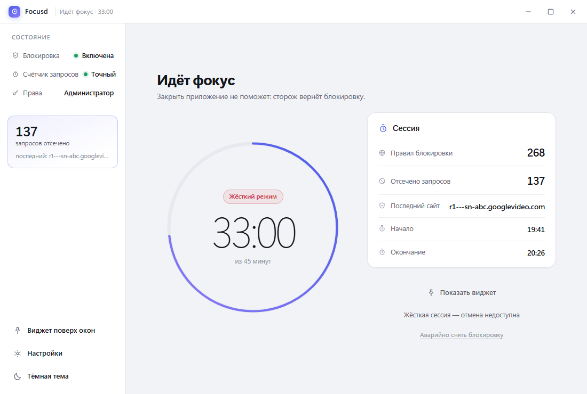
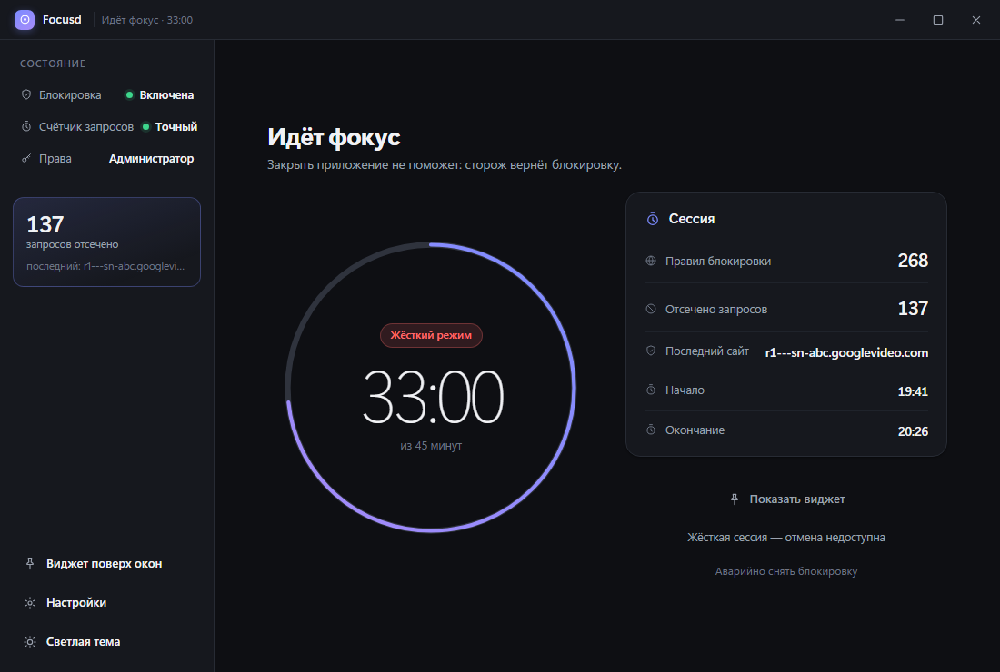
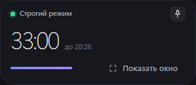
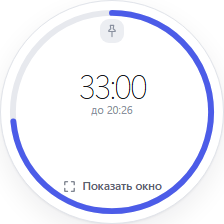
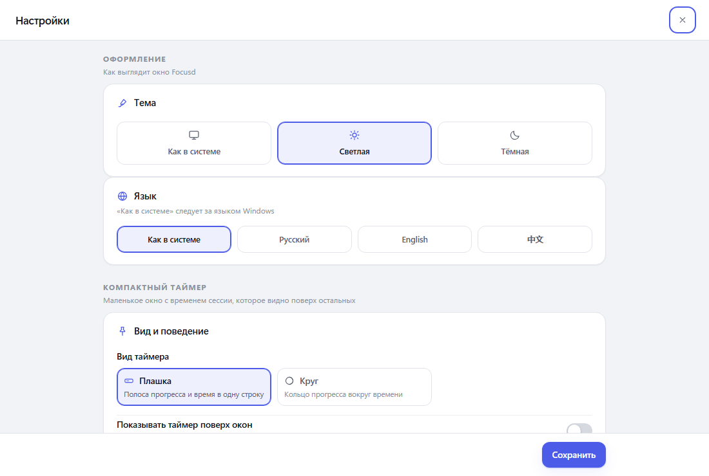
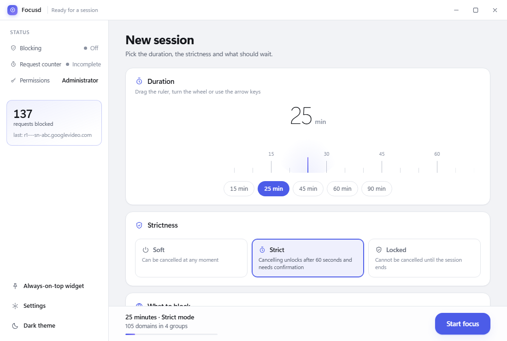
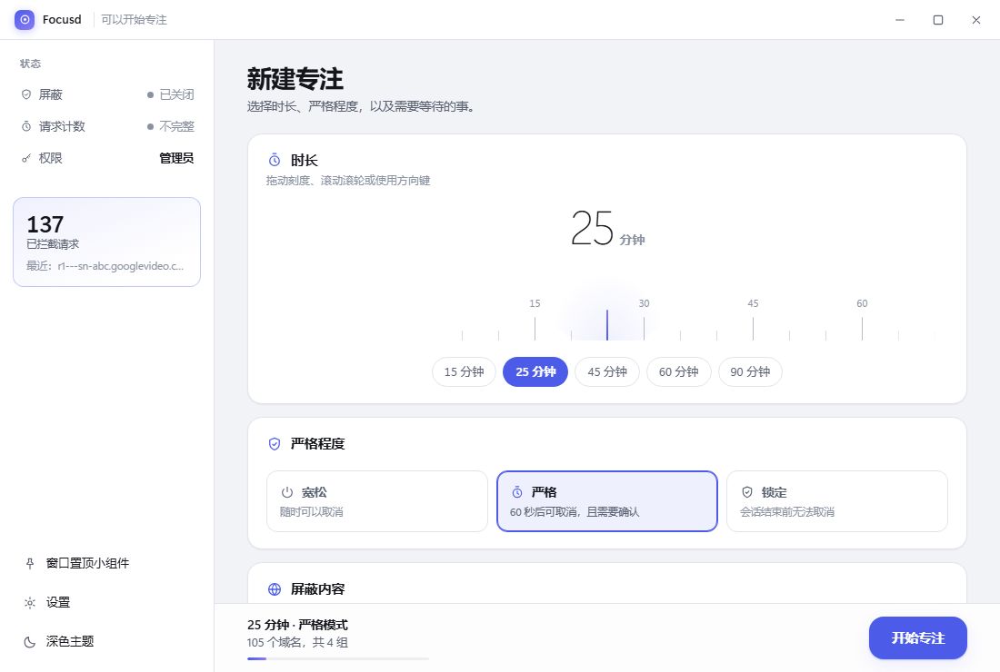

# Focusd

[Русский](README.ru.md) · **English**

> A focus blocker for Windows. You pick a duration and a strictness level — and distracting
> sites stop opening. No accounts, no telemetry, no background services: one local binary.




Stack: Go 1.25 + Wails v2 (WebView2) + Vite/TypeScript. A single ~10 MB binary, ~35 MB in
memory, no Electron and no background services.

## Contents

- [Why another blocker](#why-another-blocker)
- [Screenshots](#screenshots)
- [How it works](#how-it-works)
- [Strictness levels](#strictness-levels)
- [Install and build](#install-and-build)
- [Administrator rights](#administrator-rights)
- [Interface](#interface)
- [What Focusd does not do](#what-focusd-does-not-do)
- [Limitations](#limitations)
- [Emergency recovery](#emergency-recovery)
- [Tests](#tests)
- [Project structure](#project-structure)
- [Data and privacy](#data-and-privacy)

## Why another blocker

Most site blockers cut the request **inside the browser** (through policies or an extension).
That has two consequences: you can never see how many requests were actually stopped, and
anything the browser can be talked out of — DoH, a DNS change, a VPN — walks straight past.

Focusd puts an **HTTP proxy on the path of the traffic** instead. Because the proxy sees every
attempt to open a site, the counter is alive, the rule covers subdomains, open connections to
blocked sites are dropped the moment a session starts, and turning focus on or off never needs
a browser restart. Browser policies stay in the app, but only as a fallback safety net.

## Screenshots

**New session** — duration is picked on a ruler under a fixed pointer: drag, scroll or use the
arrow keys in 5-minute steps, and you always see exactly where you are landing.


**Session running** — the timer is a thin ring with large digits; the sidebar reports the live
counter and the last site that was cut off.



**Dark theme** — light, dark, and “System”, applied before the first frame so the dark theme
never starts with a white flash.



**Always-on-top widget**, both shapes — a bar with a progress line, or a progress ring around
the time. Draggable by any free spot, position remembered, above all windows.

| Bar 320×140 | Ring 224×224 |
|---|---|
|  |  |

**Settings** — appearance, compact timer, default session, protection, what to block,
application.



**Three languages** — Russian, English and Chinese. By default the app follows the Windows
locale and falls back to English for anything unfamiliar.

| English | 中文 |
|---|---|
|  |  |

## How it works

Blocking has two layers, and the layers are deliberately independent: the failure of either one
does not cancel the other.

### Main layer: the local proxy

Focusd raises an HTTP proxy on `127.0.0.1` and writes it into Chromium-based browsers (Chrome,
Edge, Chromium, Brave, Vivaldi, Yandex, Opera) through the `ProxySettings` policy — **for the
whole time the application runs**, not for the duration of a session.

The proxy sits **on the path of the traffic**, so it sees every attempt to open a site and can
count it. Everything else follows from this:

- **The counter is alive.** Previously “Requests blocked” always showed zero: the `URLBlocklist`
  policy cuts the request inside the browser, before the network, and from the outside its work
  is unobservable in principle — there was nothing to count. Now every blocked request is
  visible and counted, and the interface shows the last closed site.
- **There is nothing to bypass.** The browser goes to the proxy before anywhere else, so neither
  DoH, nor a DNS change, nor a VPN gets in the way of this layer.
- **Restarting the browser is never needed** — neither when focus is switched on nor when it is
  switched off. This holds for both ways of getting the browser to the proxy — the policy and the
  system proxy (see below). Why it did not work otherwise: also below.
- **A rule covers subdomains.** `youtube.com` closes `www.`, `m.` and `music.` — both for
  blocking and for exceptions.
- **The start of a session drops connections that are already open** to blocked sites. A tunnel
  to YouTube established before the focus does not help: the proxy knows the name of the
  destination and tears it down itself, and the browser, re-establishing the connection, gets a
  refusal. Exceptions are respected here too.

#### The second way: the system proxy

Not all browsers read policies. **Yandex Browser** puts it in the documented path
`HKLM\SOFTWARE\Policies\YandexBrowser`, but on a live browser it is visible that it ignores the
Focusd policy: a fresh instance with our policy does not open a single connection to the proxy,
while with the system proxy it opens all of them. That is why, alongside the policy, Focusd also
writes the Windows system proxy (`HKCU\...\Internet Settings`): everyone who can go through a
proxy at all listens to it, and picks it up on the fly — verified on an already running Yandex:
after the system proxy changed, connections started going through Focusd without a restart, and
after it was removed they went directly again (`go run tools/policyprobe.go`).

Focusd removes the previous settings before the substitution and restores them on exit, by
emergency recovery (`--restore`) and by the guard task. The snapshot lies in `config.json`, so it
also survives an abnormal termination: otherwise there would be nothing to restore. The PAC file
is removed for the duration — it takes precedence over `ProxyServer`, and with it a foreign
script would be the one doing the proxying.

The price for this is a wider reach than browsers: while Focusd runs, other programs that use the
system proxy also go through its proxy. Outside a session it lets everything through, so this is
noticeable only during focus. Your own proxy settings (corporate ones, for example) are
substituted for the duration — they come back on exit.

#### The safety net: why a reboot does not leave you without internet

The proxy lives inside the process, while the settings that point at it live in the registry and
survive everything. If the application did not live to its own exit, browsers go to a port nobody
is listening on: `ERR_PROXY_CONNECTION_FAILED` on any site. That is what happened after a
computer reboot — Windows terminates processes itself, the exit handler does not have time to
restore the settings, and the person is left without internet before they open anything.

Therefore, for as long as the proxy is written in, Focusd keeps two scheduler tasks
(`FocusdProxyGuard` and `FocusdProxyGuardMinute`) — they run `Focusd.exe --proxyguard`. That one
works only when the application is not running (it checks the instance lock) and in that case
removes the proxy policy and restores the settings from the snapshot. It does not touch the
`URLBlocklist` lists: they hold a locked session, and removing them would mean giving away a
bypass.

Two tasks rather than one because the scheduler's schedule is set with a single trigger per call:
“at sign-in” fixes a reboot at once, “once a minute” fixes an application killed without a
reboot. Both are removed on a normal exit.

#### Why the policy is not removed at the end of a session

The first variant enabled the policy for the duration of a session and removed it when the
session ended. That turned out not to work, and not because of a bug in the code: **Chromium does
not re-read proxy settings on the fly**. The policy is deleted from the registry instantly, but
the browser notices the change only on the next poll — up to ten minutes. All that time it keeps
going to a port nobody is listening on any more, and the person sees
`ERR_TUNNEL_CONNECTION_FAILED` **on any site**. Switching focus off looked like a broken internet,
and was cured only by restarting the browser.

So the policy became permanent, and the mode is switched inside the proxy itself: during a
session it cuts, outside a session it passes everything through transparently. The policy does
not change by a single byte — the browser has nothing to re-read — and access returns the same
instant. It is removed on application exit, by emergency recovery and by the guard task when the
application is closed.

The second bug lived exactly in this “releasing” branch: a disabled proxy passed requests along
the common path, including `CONNECT`, so the tunnel for HTTPS did not open — and after the session
ended not a single site worked at all. Releasing the blocking must be as careful as setting it;
there is a separate test for that.

Before writing the policy into the browsers, Focusd checks the proxy with a live request. A proxy
that listens on the port but cannot get out to the internet would leave the person without a
single page that opens — and Focusd would be the one to blame for it. If it fails the check, the
layer is not enabled at all, and the fallback policy takes over the blocking. After that a
watchdog looks after the proxy: if requests keep coming and none has reached its destination, it
first tries to raise the proxy again, and only if that fails does it remove the policy and fall
back to the spare layer.

The price for this is the reach and the look of the error. Only Chromium-based browsers read the
policy, and a blocked **HTTPS** site is shown by the browser as its own network error: through
`CONNECT` the proxy's answer is not displayed. That is exactly what you see when trying to open a
closed site — `ERR_TUNNEL_CONNECTION_FAILED` on that one site, with the rest working. For ordinary
HTTP our stub page is served. As for other applications — Telegram, Steam, mail clients — Focusd
does not restrict them: only browsers are closed.

### Fallback layer: browser policies

If the proxy could not be raised or written in, `URLBlocklist` is enabled with the same list of
domains, and the exceptions go into `URLAllowlist`. The policy acts **inside the browser and cuts
the request before it goes out to the network**, so it is unbreakable — but also unobservable:
with it you cannot find out how many requests were cut. That is why it is a safety net rather than
the main mode.

The domains of public DoH resolvers are added to the block in strict modes: browser name
resolution sits behind the proxy, but the extra precaution is free.

The **scheduler guard task** checks once a minute that the locked session is still holding: if the
application was closed, it writes the browser policies again and restarts Focusd. It removes the
proxy policy at the same time — but only when the application is genuinely not running: a proxy
left in the policy without a running application would leave the browser without a network.

## Strictness levels

| Level | Cancellation | What it is for |
|---|---|---|
| **Soft** | immediately | “I'll work, but I'll switch it off if I need to” |
| **Strict** | after 60 seconds and with confirmation | to get through the “just one more episode” impulse |
| **Locked** | unavailable until the end of the session | when you need an external contract with yourself |

The session is written to disk, so restarting the application does **not** interrupt it: on start
a locked session is raised again together with the blocking.

## Install and build

### Run a release build

1. Download `Focusd.exe` from [Releases](https://github.com/VladimirKarpenkoMain/focusd/releases)
   (or build it yourself, below).
2. Run it and accept the UAC prompt — see [Administrator rights](#administrator-rights).
3. Pick the duration, the strictness and what should wait, then press **Start focus**.

To close a session early: **Soft** — any time, **Strict** — after a 60-second hold with a
confirmation, **Locked** — only through emergency recovery, which is deliberately buried on the
session screen.

### Build from source

Requirements: Windows 10/11, [Go 1.25+](https://go.dev/dl/), Node.js 18+, and the
[WebView2 runtime](https://developer.microsoft.com/microsoft-edge/webview2/) (already present on
current Windows builds).

```powershell
# 1. Once: the Wails tool
go install github.com/wailsapp/wails/v2/cmd/wails@latest

# 2. Icon (optional, already generated in build/windows/icon.ico)
go run tools/genicon.go

# 3. Build
wails build -clean
```

The finished file: `build/bin/Focusd.exe`.

For interface development: `wails dev`.

## Administrator rights

The application requests elevation (the `requireAdministrator` manifest). This is needed in order
to: write the proxy policy into the browsers, write the fallback browser policies and register the
scheduler tasks. Focusd does not touch the system's network settings at all — with the single
exception of the system proxy described above, which it snapshots and restores. Without the rights
the application will start, but it will honestly show the banner “blocking will not work”.

## Interface

A windowed application with its own frame: the title bar and the window buttons are drawn by the
interface itself, so compact mode looks like a widget rather than like a window that has
accidentally shrunk.

- **Three languages** — Russian, English and Chinese. By default “System” is selected: the
  application reads the Windows locale (`LocaleName` in the registry) and speaks it, while
  everything unfamiliar is reduced to English. The switcher is in the settings, in the
  “Appearance” section, next to the theme. The language applies immediately, like the theme, and
  redraws the whole window; the settings panel is rebuilt at the same time, keeping the draft —
  otherwise changing the language would cost you the domains you had typed but not yet saved.
  Everything a person reads is translated: group captions arrive from Go already translated, while
  notices and hints are stored as keys and translated at the moment they are shown — otherwise
  changing the language mid-session would leave them in the previous language. The Russian strings
  are the source, and they also define the set of keys: a missing translation in English or
  Chinese finds no key and breaks the frontend build, instead of turning into a Russian string in
  the middle of an English window.
- **Two themes**, light and dark, plus a “System” mode. The theme is applied before the first
  frame: a built-in script reads the choice from `localStorage` while the settings are still
  loading asynchronously, so the dark theme does not begin with a white flash. The switcher is in
  the sidebar next to “Settings” and in the settings themselves. It has no place in the window
  title bar: that has “Minimise”, “Maximise” and “Close Focusd”, and a miss there would mean
  closing the application instead of changing the appearance.
- **Custom sites** are a first-class thing, not a hidden checkbox: the block list and the
  exceptions list are edited right on the launch screen. Next to them is a check field: type a
  domain and see at once whether it falls under a rule or not. The domain is validated before
  saving — the block editor must not silently swallow a typo.
- **Duration** is chosen with a ruler: under a fixed pointer a scale with tick marks travels. Drag
  with the mouse, turn the wheel, press the arrows — the value changes in steps of 5 minutes. This
  is more precise than a slider: you can see exactly where you are landing.
- **The timer** is a thin ring and large digits; over the last minute they turn red and start to
  breathe.
- **The icons** are drawn by hand as one set of outlines on a 24×24 grid. No emoji as icons and no
  external fonts or CDNs — the application is offline. The typography is system: Segoe UI Variable,
  the same font as Windows itself.

### Widget

The “Always-on-top widget” button shrinks the window to the timer and enables the “Keep above all
windows” mode: the session time stays visible whatever you are doing. There are two shapes, chosen
in the settings, in the “Compact timer” section:

- **Bar 320×140** — time, progress bar and mode caption on one line.
- **Ring 224×224** — a progress ring around the time. The window becomes a square, and the ring is
  drawn as an SVG exactly the size of the window: the arc goes in the same units as the pixels, so
  the line stays even without recalculating coordinates. Without a session the ring is dashed: a
  solid empty ring is indistinguishable from a full one.


Common to both shapes:

- **Going back to an ordinary window is signed with words.** The “Maximise” icon — a square — read
  in the widget as “shrink into a little square”, that is, exactly the opposite, so the “Show
  window” button comes with words: in the bar next to the progress bar, in the ring on a separate
  line under the time.
- **It is dragged with the mouse by any free spot** — Wails treats an element with
  `--wails-draggable: drag` as a drag area, and the style is inherited by nested elements, so
  saying “no” to the buttons alone is enough.
- **The position is remembered.** Otherwise the widget would return every time to the corner it
  had just been carried away from. The position is written to disk on leaving the mode and on
  closing the application, not on every mouse movement.
- **“Keep above all windows” is turned off separately** — with a pin button in the widget itself
  or with a toggle in the settings. The timer is sometimes needed as an ordinary small window too.
- Changing the shape applies immediately: there is no point waiting for “Save” and a restart.
- The mode survives an application restart together with the settings.

### Settings

The panel is split into sections: “Appearance”, “Compact timer”, “Default new session”,
“Protection”, “What to block”, “Application”. The cards go one per line rather than in a
two-column grid: in narrow cards the caption on the right ran into the heading and both lines
became unreadable. The card caption now sits under the heading — the `tools/uicheck.go` check
measures the rectangles and fails if they intersect again.

The theme, the timer shape and the “Keep above all windows” mode apply immediately, the rest —
with the “Save” button.

## What Focusd does not do

The DNS layer was in the application and was removed: it raised a local resolver, switched the DNS
of the network adapters over to it and thereby closed non-browser applications as well. It was
dropped for two reasons.

First, on Windows port 53 is almost always taken by the **Internet Connection Sharing (ICS)
service**: the mobile hotspot and the Hyper-V network raised by default, which WSL2 and Docker
Desktop use, start it. Windows reserves the port for it, and a call to `127.0.0.1:53` from another
process gets access denied — even though the resolver's socket opens perfectly, so the conflict is
not visible from the binding error alone, and an “is the port free” probe lies. The layer silently
did not work, and a note about svchost and Hyper-V appeared in the interface, reading as a broken
application.

Second, for blocking browsers it is not needed at all: the proxy resolves names on its side. The
counter did not depend on it either.

What this means in practice: **Focusd restricts browsers and those programs that go through the
Windows system proxy**. Applications with their own way of connecting — Telegram, Steam, mail
clients — it does not close. The risks of interfering with the system DNS have not come back,
though: Focusd does not touch DNS, and the system proxy is an ordinary Windows setting, visible in
the system settings and restored by Focusd as it was.

## Limitations

- **A blocked HTTPS site shows the browser's network error**, not our page: the browser does not
  display the proxy's answer to `CONNECT`. For ordinary HTTP a stub page is served. What exactly
  is closed is visible in the application — it shows the last blocked site.
- **A proxy left in the policy without the application will leave the browser without a network.**
  Therefore the policy is removed on closing the application, by emergency recovery (`--restore`),
  by the guard task and by the proxy safety net — but only when the application is genuinely not
  running. While it runs, the policy stands deliberately and is not removed even by the guard:
  removing it does not restore access, it takes it away (see “Why the policy is not removed at the
  end of a session”). Beyond that, the proxy passes a live-request check before it is enabled, and
  after that a watchdog looks after it. If the safety net did not work — the tasks were deleted by
  hand, for example — `Focusd.exe --restore` comes to the rescue.
- **Firefox and desktop applications are not closed.** The `ProxySettings` and `URLBlocklist`
  policies are read only by Chromium-based browsers: Chrome, Edge, Chromium, Brave, Vivaldi,
  Yandex, Opera. Firefox and everything else is not restricted by Focusd — see “What Focusd does
  not do”.
- **On a closed site the browser shows `ERR_TUNNEL_CONNECTION_FAILED`.** This is not a fault: that
  is what cutting HTTPS looks like, because the browser does not display the proxy's answer to
  `CONNECT`. The other sites open at the same time.
- **Tabs already open to blocked sites are closed along with the start of a session.** The proxy
  tears down the established tunnels to them, and the browser, re-establishing the connection, gets
  a refusal. Without this, YouTube opened before the focus kept playing over the old connection,
  and it looked like “focus does not work” — even though in a private window the same site no
  longer opened: there are no connections there yet. There is a check for this in
  `internal/proxy/proxy_test.go`.
- The `URLBlocklist` policies of the fallback layer are picked up by the browser **at the next
  start** — that is why the fallback layer is a fallback. The main layer, the proxy, works without
  restarts in both directions: by policy and by system proxy (`go run tools/policyprobe.go` checks
  both directions).
- Blocking can work by path (`youtube.com/shorts`), but the catalogue so far consists of whole
  domains.
- **The log and technical errors stay in Russian.** What is translated is what a person reads as
  part of the interface; the text of exceptions from Go — for example, “не удалось создать каталог
  данных” (the data folder could not be created) — lands in the red banner as is. This is a
  deliberate boundary: such strings are addressed to whoever will deal with the fault, not to
  whoever chose English in the settings.
- **Windows only.** Focusd is built on Windows policies, the Windows scheduler and the Windows
  registry; there is no macOS or Linux port.

## Emergency recovery

If something went wrong and the internet is gone:

```powershell
Focusd.exe --restore
```

Removes the proxy policy and the site lists, deletes the guard tasks and closes the session. It
restores the system proxy from the snapshot in `config.json`; network settings that Focusd did not
change are not touched.

In the interface there is the “Emergency unblock” link on the session screen for this. The
application and `--proxyguard` are enough for the case of a reboot — emergency recovery is needed
when the safety net did not work for some reason.

## Tests

```powershell
go test ./...
```

Coverage is **100 % of statements** across all the application's Go code: `internal/*` and the root
`app.go` with `main.go`.

```powershell
go test ./... -coverprofile=coverage.out
go tool cover -func=coverage.out
```

What is covered:

- **Domain matching** (`rules`) — label boundaries, exceptions, TLDs, parsing of junk and ports.
- **The session state machine** (`focus`) — all three strictness levels, expiry, restart, the hold
  before cancellation.
- **Configuration** (`config`) — reading, writing, rollback of a failed write, a corrupt file,
  values from future versions.
- **The proxy** (`proxy`) — cutting `CONNECT` and ordinary requests, exception priority, passing
  traffic outside a session (including the tunnel for HTTPS), self-check on a live request, health
  counters, port scanning and dropping already-open tunnels to blocked sites.
- **The system layer** (`winsys`) — browser policies, the system proxy, scheduler tasks, the
  instance lock, the owner of port 53, the Windows locale.
- **Translations** (`i18n`) — language parsing (including the three-letter codes of old Windows
  versions), argument substitution, group captions, strictness levels and the stub page. The
  English and Chinese tables are checked against the key set: a new key without a translation is
  visible to the test, not to the person.
- **The application** (`app.go`, `main.go`) — start and exit, both blocking layers and the switch
  between them, the proxy watchdog, the counters, the widget, the settings, custom domains and
  exceptions, and all three command-line modes.

The real policies live in `HKLM` and require administrator rights, the scheduler tasks are created
for real, and there is no WebView2 window in the test at all. Therefore system and window calls are
moved into seams (`platform.go`, and inside `winsys` — `registry_windows.go` and `runExternal`),
and the tests substitute their own implementation. In production the seams are assembled from real
calls and do not change. The registry that the tests really do need is read and written only in
`HKCU`: in a restricted environment (a sandbox, someone else's profile) such tests are skipped
rather than failing.

A live check of the proxy on the real internet, with the full rule catalogue:

```powershell
go run tools/proxyprobe.go
```

The script raises the proxy, drives a real Chrome through it in a separate profile and prints a
table of “opened / closed” for live and blocked sites. At the end it switches the blocking off and
checks that the sites open again and the counter does not grow — this is exactly what broke access
after the end of a session. The script does not touch the registry, so it does not disturb open
browser windows.

Separately there is a probe of the proxy policy (`go run tools/policyprobe.go`, administrator
rights required): it checks whether Chromium picks up the proxy policy in an already running
window. The answer to that question determined the whole architecture of the layer.

Checking the interface — real rendering in a headless browser:

```powershell
cd frontend; npm run build; cd ..
go run tools/uicheck.go
```

The script raises the built frontend, substitutes the Wails bridge with real data from the Go
configuration and captures the DOM. It catches an empty window — a failure that ordinary tests do
not see — and also puts screenshots of all the screens into `preview/`: both themes, the session
screen, both widget shapes, the minimum window size and both translations.

Not only the presence of elements is checked, but behaviour too: a ruler is sent an arrow key
press, and the value must shift by one step; on a key it does not handle, it must stay as it was.
The second half of the condition matters, otherwise the check would pass on a completely dead
handler as well. A separate check measures the rectangles of the heading and the caption of every
settings card: overlapping text cannot be caught by markup, but it is visible to the eye at once.
On top of that the harness refuses to work on an outdated bundle and checks its own detector, so
that the “OK” is not false.

English and Chinese are checked by the same harness: it requires that the strings be translated,
that the group captions arrive from Go already translated, that the document be declared with the
same language, and that the previous Russian strings are not left on the screen. The language
switcher is genuinely clicked — with a check that the list item is hit — because changing the
language rebuilds the whole frame, and that can only be seen by clicking. The harness also catches
the least noticeable thing: the static captions of the shell are assembled when the module loads,
when the language has not been read yet, so they are re-read on start as well.

The widget is shot in a frame exactly the size of the window — 320×140 for the bar and 200×200 for
the ring: a Chrome window does not go below ~500 px in width and cuts the height, so a small
mock-up is drawn in a large frame and cropped — otherwise the snapshot would show a cropped mock-up
rather than what the person sees.

## Project structure

```
main.go                    entry point, --guard / --proxyguard / --restore modes
app.go                     wires the storage, the proxy and the sessions together
internal/
  catalog/                 built-in catalogue of blocked services
  rules/                   domain matching (suffix at a label boundary)
  proxy/                   local proxy: browser blocking and counting
  blockpage/               stub page for closed sites
  focus/                   session state machine and strictness levels
  config/                  storage of settings and session state
  i18n/                    translations: catalogue, stub page, hints, system language
  winsys/                  Windows: browser policies, scheduler, registry, locale
frontend/                  Vite + TypeScript, no framework
  src/i18n.ts              Russian, English and Chinese dictionaries
tools/
  proxyprobe.go            live proxy check through a real Chrome
  policyprobe.go           checks whether Chromium picks up the proxy policy
  uicheck.go               interface rendering and screenshots of the screens
docs/screenshots/          previews used in this README
build/windows/             manifest (requireAdministrator)
```

## Data and privacy

`%LOCALAPPDATA%\Focusd\` — `config.json`, `focusd.log`, `focusd.instance.lock`.

All of it stays on your machine: Focusd has no network side of its own, no accounts and no
telemetry. The only outbound traffic is what your browser sends through the local proxy — and
outside a session the proxy passes everything through untouched.

## Contributing

Issues and pull requests are welcome. Before opening a PR, please run:

```powershell
go test ./...
```

The project keeps 100 % statement coverage, and it is part of the contract rather than a nice
number: a change that drops it is a change that has to argue for itself.
